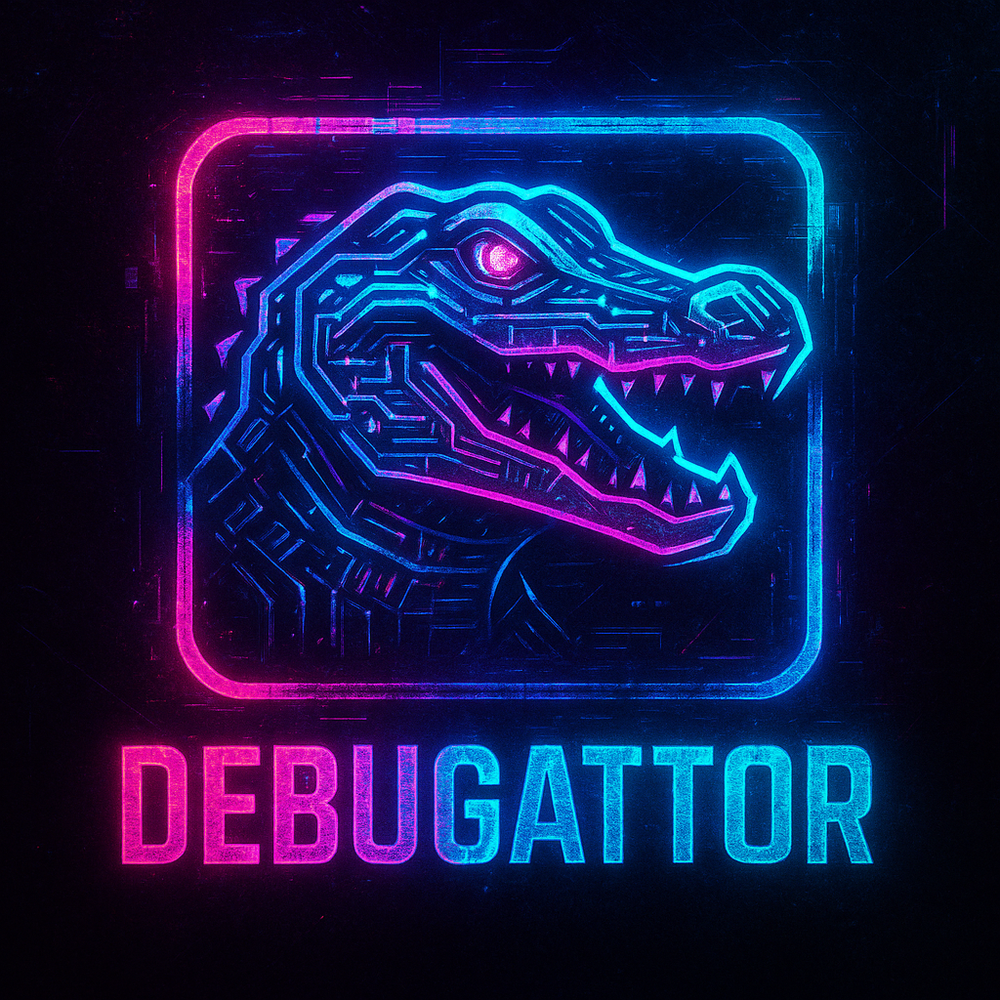
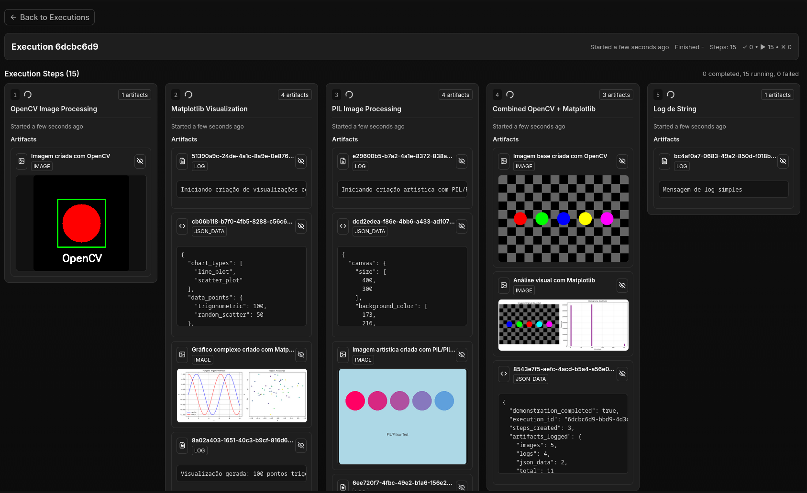

A **lightweight** experiment execution tracker for ML/AI/Computer Vision projects. Start an **execution**, record its **steps**, and **log artifacts** (logs, images, JSON) for each step. At the end you get a complete, queryable **timeline** of the experiment.




- Multi-module Gradle project
- Hexagonal architecture with clear separation of concerns
- Spring Boot 3 (REST), PostgreSQL, Flyway, jOOQ (type-safe SQL)
- Integration tests with Testcontainers and RestAssured

---

## Why this project
Backend portfolio project showcasing:

- Designing a clean domain model for experiment tracking (Executions → Steps → Artifacts)
- Hexagonal layering (domain, application, infrastructure) with ports and adapters
- jOOQ for type-safe SQL and advanced record mapping (multiset)
- Migrations-first schema and jOOQ code generation from Flyway SQL
- Pragmatic developer experience: Docker Compose for Postgres, Testcontainers for tests, Gradle wrapper

---

## Architecture at a glance

Hexagonal architecture mapped to Gradle modules:

- domain (pure domain model and ports)
  - Execution, Step, Artifact records
  - Ports: ExecutionRepository, StepRepository, ArtifactRepository
- application (use cases, no framework dependencies)
  - StartExecutionUseCase, FetchExecutionsUseCase, GetExecutionByIdUseCase, RegisterStepUseCase, LogArtifactUseCase
- infrastructure (adapters, wiring, Spring Boot app)
  - Primary adapter (HTTP): ExecutionHttpAdapter exposes REST endpoints
  - Secondary adapter (Persistence): JOOQRepository implements domain ports using jOOQ
  - Bootstrap: UseCasesConfiguration wires ports to use cases, JOOQConfiguration builds DSLContext
  - Flyway migrations define schema and drive jOOQ code generation

Key properties of the layering:

- Domain is framework-agnostic, just types and interfaces (ports)
- Application orchestrates domain through ports (use cases)
- Infrastructure adapts the outside world (HTTP, Postgres) to domain ports
- Primary/secondary adapters can be replaced independently

Package/module map:

- domain/src/main/java/com/teixeirah/debugattor/domain
  - execution: Execution, ExecutionRepository
  - step: Step, StepRepository
  - artifact: Artifact, ArtifactRepository
- application/src/main/java/com/teixeirah/debugattor/application/usecases
  - StartExecutionUseCase, FetchExecutionsUseCase, GetExecutionByIdUseCase, RegisterStepUseCase, LogArtifactUseCase
- infrastructure/src/main/java/com/teixeirah/debugattor/infrastructure
  - Application (Spring Boot entry point)
  - primary/ExecutionHttpAdapter (REST controller)
  - secondary/persistence/JOOQConfiguration (DSLContext)
  - secondary/persistence/JOOQRepository (implements domain ports)
  - bootstrap/UseCasesConfiguration (bean wiring)

---

## Data model

- Execution
  - id (UUID), startedAt (timestamptz), finishedAt (timestamptz|null)
  - 1..n Steps
- Step
  - id (UUID), executionId, name, status (RUNNING|COMPLETED|FAILED)
  - registeredAt (timestamptz), completedAt (timestamptz|null)
  - 0..n Artifacts
- Artifact
  - id (UUID), stepId, type (IMAGE|LOG|JSON_DATA), content (TEXT), loggedAt (timestamptz)

Schema migrations (Flyway):
- jOOQ code generation is configured to read the Flyway SQL (DDLDatabase) so generated types always reflect the current schema. The Gradle task compileJava depends on jooqCodegen, and the generated sources are added to the main source set.

---
## Runtime & configuration

- Spring Boot app lives in the infrastructure module
- Virtual threads enabled (spring.threads.virtual.enabled=true)
- JSON serialization time zone set to America/Sao_Paulo
- Configuration (infrastructure/src/main/resources/application.yaml)
  - Database URL uses env vars with defaults:
    - DB_HOST (default localhost)
    - DB_NAME (default debugattor)
    - DB_USERNAME (default debugattor)
    - DB_PASSWORD (default debugattor)
  - Flyway enabled by default (FLYWAY_ENABLED=true)

---

## API

Base path: /api

- POST /api/executions
  - Starts a new execution
  - Response 200: Execution
- GET /api/executions
  - Lists all executions (including steps and artifacts)
  - Response 200: Execution[]
- GET /api/executions/{executionId}
  - Gets a single execution by id
  - Response 200: Execution, 404 if not found
- POST /api/executions/{executionId}/steps
  - Body: { "name": "string" }
  - Registers a new step for an execution
  - Response 200: updated Execution
- POST /api/executions/{executionId}/steps/{stepId}/artifacts
  - Body: { "type": "LOG|IMAGE|JSON_DATA", "content": "string" }
  - Logs an artifact for a step
  - Response 200: Artifact

Example flow (curl):

```bash
# 1) Start an execution
curl -s -X POST http://localhost:8080/api/executions | jq .

# 2) Register a step
EXEC_ID=<uuid>
curl -s -X POST \
  -H 'Content-Type: application/json' \
  -d '{"name":"Preprocessing"}' \
  http://localhost:8080/api/executions/$EXEC_ID/steps | jq .

# 3) Fetch to discover the step id
STEP_ID=$(curl -s http://localhost:8080/api/executions/$EXEC_ID | jq -r '.steps[0].id')

# 4) Log a log artifact
curl -s -X POST \
  -H 'Content-Type: application/json' \
  -d '{"type":"LOG","content":"Converted to grayscale"}' \
  http://localhost:8080/api/executions/$EXEC_ID/steps/$STEP_ID/artifacts | jq .

# 5) List all executions (with nested steps and artifacts)
curl -s http://localhost:8080/api/executions | jq .
```

Response shapes (abbreviated):

```json
// Execution
{
  "id": "e3b3...",
  "startedAt": "2025-09-09T15:27:12.345-03:00",
  "finishedAt": null,
  "steps": [
    {
      "id": "b2c1...",
      "name": "Preprocessing",
      "status": "RUNNING",
      "registeredAt": "2025-09-09T18:27:13.123Z",
      "completedAt": null,
      "artifacts": [
        {
          "id": "a1d2...",
          "type": "LOG",
          "content": "Converted to grayscale",
          "loggedAt": "2025-09-09T15:27:14.001-03:00"
        }
      ]
    }
  ]
}
```

### OpenAPI

- Spec file: infrastructure/src/main/resources/static/openapi.yaml
- Served locally at: http://localhost:8080/openapi.yaml
- Open in Swagger Editor: https://editor.swagger.io/?url=http://localhost:8080/openapi.yaml

---


## Getting started (end users)

You can run the entire application (backend, frontend, and database) using Docker Compose. No Java, Node.js, or local builds required.

### Prerequisites

- [Docker](https://docs.docker.com/get-docker/) and [Docker Compose](https://docs.docker.com/compose/install/)

### Start the full stack

1. Build and start all services (API, UI, and database):

  ```bash
  docker compose -f compose-app.yaml up --build -d
  ```

2. Access the web UI at [http://localhost:3000](http://localhost:3000)

3. The API is available at [http://localhost:8080/api](http://localhost:8080/api)

4. The database runs on port 5432 (PostgreSQL).

### Stopping services

To stop all containers:

```bash
docker compose -f compose-app.yaml down
```

---

## Getting started (local development)

Prerequisites:

- Docker + Docker Compose (for local Postgres)
- JDK 21 (recommended; 17+ should work)
- Bash-compatible shell (for the example commands)

Start Postgres locally:

```bash
docker compose up -d db
```

Run the application (Spring Boot in infrastructure module):

```bash
./gradlew :infrastructure:bootRun
```

Configuration via environment variables (all have defaults):

```bash
export DB_HOST=localhost
export DB_NAME=debugattor
export DB_USERNAME=debugattor
export DB_PASSWORD=debugattor
export FLYWAY_ENABLED=true
```

Build all modules:

```bash
./gradlew build
```

---

## Testing

Tests live in the infrastructure module and use:

- Testcontainers (PostgreSQL) as the backing database in tests
- RestAssured for HTTP-level assertions against a random-port Spring Boot app (I'm planning on changing to Groovy & Spock)

Run tests:

```bash
./gradlew :infrastructure:test
```

The integration test ExecutionHttpAdapterTest covers the end-to-end flow:

- Start an execution
- Register a step
- Log an artifact
- Verify via GET that the nested structure persists correctly

---

## Roadmap / ideas

- Step lifecycle endpoints (complete/fail step, finish execution)
- Filtering/query params on GET /api/executions
- Artifact storage backends (S3/GCS for large blobs; content currently stored as TEXT)
- Authentication/authorization for multi-user scenarios
- OpenAPI/Swagger documentation
- Observability: metrics and structured logs

---

## Repository layout

```
.
├── application/        # Use cases (application services) and dependency on domain
├── domain/             # Pure domain model and port interfaces
├── infrastructure/     # Spring Boot app, adapters, wiring, migrations
│   ├── primary/        # HTTP controller (REST)
│   ├── secondary/      # Persistence (jOOQ) and config
│   ├── bootstrap/      # Use case wiring
│   └── resources/      # application.yaml, Flyway migrations
├── compose.yaml        # Postgres service for local dev
└── gradle, gradlew     # Gradle wrapper and config
```
